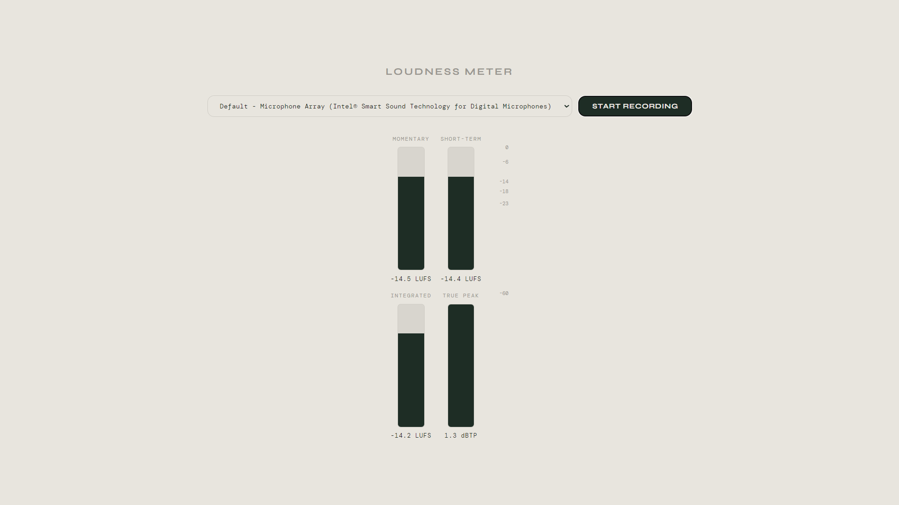

Look inside [THINKING BLOG](https://4t-audio.vercel.app/blog/loudness-qc-tool) for more technical details, calculation, definition and sources used.

[x] HTML button

[x] JS toggle

[x] Microphone access

[x] Audio capture

[x] Capture chunks

[x] K-weighting filter

[x] Loudness calculation

[x] Real-time display

[x] Integrated loudness

[x] True Peak

[x] Styling

[x] Deploy

[ ] Silero VAD on ONNX Runtime

[ ] Custom VAD model using PyTorch

[ ] Inter-sample peaks improvements

[ ] Low-pass decimation in VAD

